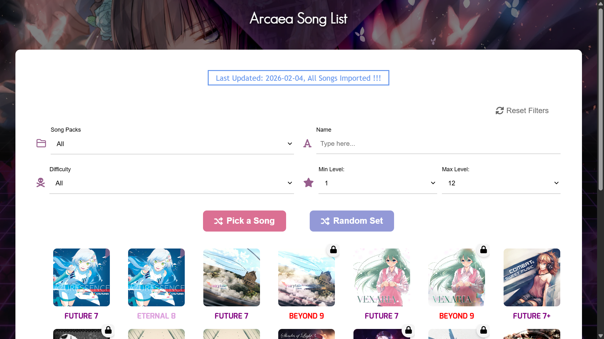
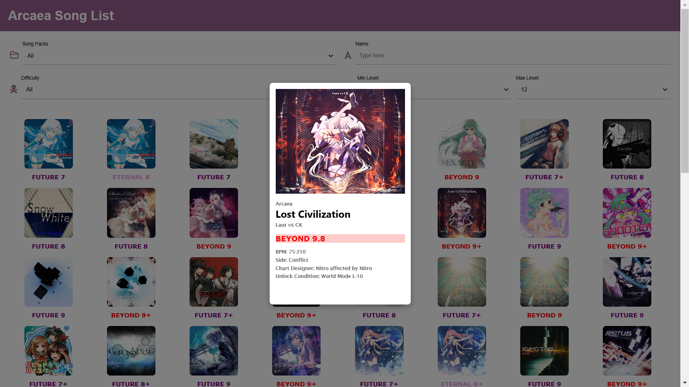
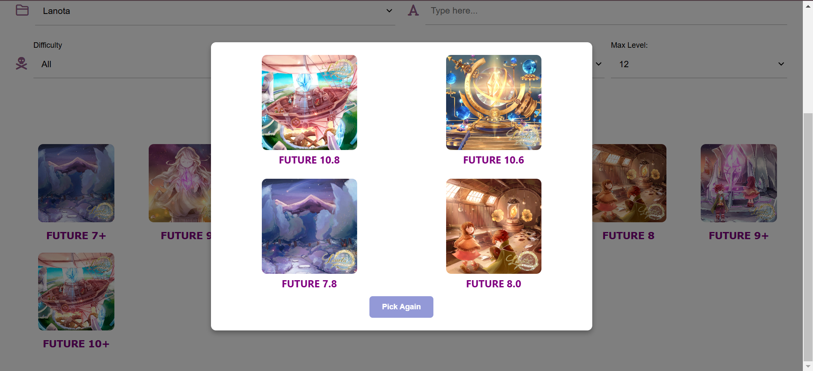

# Arcaea Web Project
This is the web project for the Arcaea mobile game. The idea is to create a website that allows players to fetch the information about songs, characters, and any other elements of the game. 

## Here's the Website !
Please refer to the [Arcaea Song List](https://omeilab.github.io/Arcaea-Web-Project/) for the website.

### Preview

---

## Latest Update (2026.2.4)

**v1.0.0 – Initial public release**

- Complete song database

- Responsive grid-based pagination
- Advanced filters (pack / difficulty / level / name)
- Random & multi-random pick
- Modal detail view
- Lazy image loading
- Mobile-friendly UI

---

## Reference
The project is inspired by [this website](https://arcade-songs.zetaraku.dev/maimai/). It provides a good reference for the design and functionality of the website about acrade music games.

The song data are referenced from [Arcaea Wiki](https://arcaea.fandom.com/wiki/Songs).