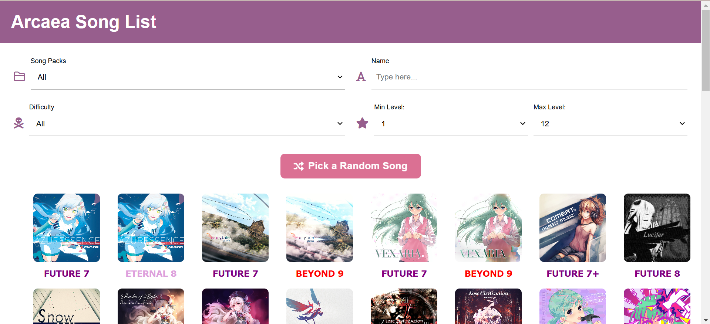
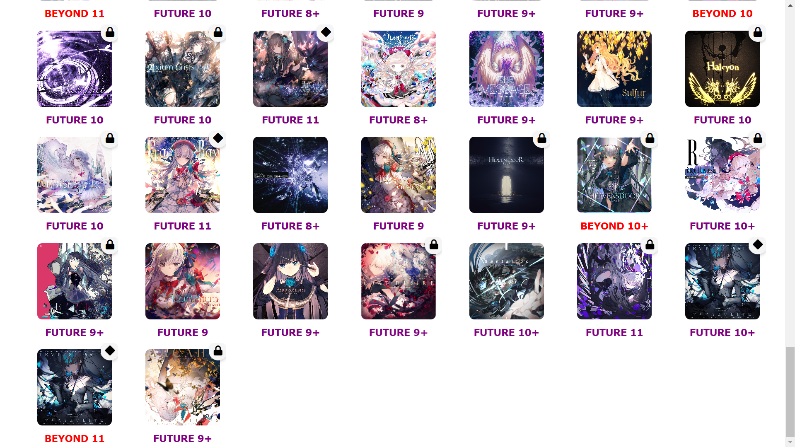

# Arcaea Web Project
This is the web project for the Arcaea mobile game. The idea is to create a website that allows players to fetch the information about songs, characters, and any other elements of the game. 

## Daily Updates

Date: 2025.2.4
- [x] Add random set button
- [x] Add song packs "Dynamix", "Lanota" and "Tone Sphere" 
  
## Tomorrow's Plan
- Generate song information in JSON format.
  * Groove Coaster

## Note
* Since multi-selection will be very ugly if using `multiple` attribute, I will use checkboxes instead later in the dynamic front-end stage.

## Appearence Progress 

## Reference
The project is inspired by [this website](https://arcade-songs.zetaraku.dev/maimai/). It provides a good reference for the design and functionality of the website about acrade music games.